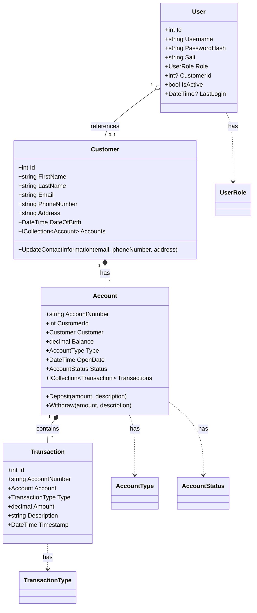
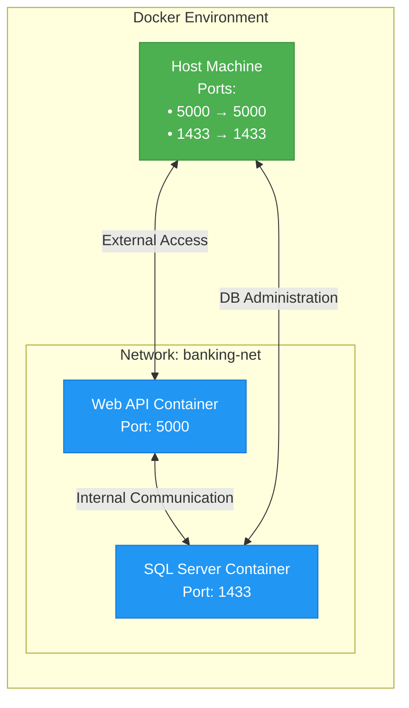

CIBC Bank Capstone Project: Enterprise Banking Application Documentation

## Table of Contents

- Overview
- System Architecture
- Domain Model
- Infrastructure Setup
- Deployment Guide
- Security Considerations
- Troubleshooting
- Enhanced Features
- Best Practices

## Overview

This document outlines the implementation of an enterprise-grade banking application for CIBC, utilizing ASP.NET MVC, SQL Server, and modern software engineering practices. The system follows Domain-Driven Design (DDD) principles and implements robust security measures suitable for financial institutions.

## System Architecture

The application employs a layered architecture with clear separation of concerns:

```mermaid
flowchart TD
    classDef presentation fill:#42A5F5,color:#000,stroke:#1976D2
    classDef application fill:#66BB6A,color:#000,stroke:#388E3C
    classDef domain fill:#AB47BC,color:#fff,stroke:#7B1FA2
    classDef infrastructure fill:#FF7043,color:#000,stroke:#E64A19
    classDef database fill:#FFCA28,color:#000,stroke:#F57C00
    
    subgraph Presentation["Presentation Layer"]
        A[MVC Controllers]:::presentation
        B[Views]:::presentation
        C[Client-Side Scripts]:::presentation
    end
    
    subgraph Application["Application Layer"]
        D[Services]:::application
        E[DTO Mappers]:::application
    end
    
    subgraph Domain["Domain Layer"]
        F[Entities]:::domain
        G[Value Objects]:::domain
        H[Domain Services]:::domain
    end
    
    subgraph Infrastructure["Infrastructure Layer"]
        I[Repositories]:::infrastructure
        J[Unit of Work]:::infrastructure
        K[CQRS Handlers]:::infrastructure
    end
    
    subgraph DB[(Database)]
        L[(SQL Server)]:::database
    end
    
    A --> D
    B --> A
    C --> A
    D --> E
    D --> H
    E --> F
    H --> F
    H --> G
    I --> L
    J --> I
    K --> D
```

The diagram illustrates the four-layer architecture of our banking application:

- Blue components represent the Presentation Layer, handling user interactions
- Green components show the Application Layer, managing business workflows
- Purple elements indicate the Domain Layer, containing core business logic
- Orange components represent the Infrastructure Layer, handling data persistence
- Yellow represents the database storage

Arrows indicate data flow and dependencies between layers. Notable patterns include:

- CQRS (Command Query Responsibility Segregation) handlers that process business operations
- DTO (Data Transfer Object) mappers that transform domain objects for presentation
- Unit of Work pattern ensuring atomic database transactions

## Domain Model

The core business entities and their relationships form the foundation of our banking domain:



The domain model diagram shows the relationships between core business entities:

- Solid diamonds (♦) indicate composition relationships (strong ownership)
- Lines with hollow diamonds (◇) show aggregation (looser coupling)
- Dotted lines represent enumeration relationships
- Numbers indicate multiplicity: "1" means exactly one, "*" means many, "0..1" means optional

Key business rules enforced by these relationships:

- Each customer can have multiple accounts (one-to-many)
- Each account belongs to exactly one customer
- Transactions are strongly tied to specific accounts
- Users can optionally be associated with a customer (for bank staff)

## Infrastructure Setup

Before deploying the application, ensure your Windows 11 Pro machine meets these prerequisites:

```powershell
# Prerequisites Check Script
$requirements = @{
    Docker = {(Get-Command docker -ErrorAction SilentlyContinue) -ne $null}
    DotNet = {(Get-Command dotnet -ErrorAction SilentlyContinue) -ne $null}
    Memory = {(Get-WmiObject Win32_OperatingSystem).TotalVisibleMemorySize -gt 8GB}
    CPU = {(Get-WmiObject Win32_Processor).NumberOfCores -ge 4}
}

foreach ($req in $requirements.Keys) {
    Write-Host "$req: $($requirements[$req].Invoke())"
}
```

The application requires Docker containers for both the web application and database:



The container architecture diagram illustrates our isolated deployment structure:

- Port mappings allow external access while maintaining container isolation
- Internal communication between containers happens over the dedicated `banking-net` network
- Separate containers for web API and database ensure resource isolation and easier maintenance
- Host machine ports are mapped to container ports for controlled external access

Deploy the application using the following PowerShell script:

```powershell
# Deploy-BankingApplication.ps1
param (
    [Parameter(Mandatory=$false)]
    [string]$SqlPassword = "P@ssw0rd123!",  # Change in production
    [Parameter(Mandatory=$false)]
    [string]$Environment = "development"
)

# Pull required Docker images
Write-Host "Pulling required Docker images..."
docker pull mcr.microsoft.com/dotnet/core/sdk:3.1
docker pull mcr.microsoft.com/mssql/server:2019-latest

# Build and push application image
Write-Host "Building application image..."
docker build -t cibc-banking-api .

# Create and start containers
Write-Host "Setting up containers..."
docker-compose -f docker-compose.$Environment.yml up -d

# Verify deployment
Write-Host "Verifying deployment..."
docker ps
```

## Security Implementation

Let's implement the enhanced security features with biometric authentication and real-time fraud detection:

```csharp
// Security/Services/BiometricAuthenticationService.cs
public class BiometricAuthenticationService : IBiometricAuthenticationService
{
    private readonly IFingerprintService _fingerprintService;
    private readonly IFaceRecognitionService _faceRecognitionService;
    private readonly IVoiceRecognitionService _voiceRecognitionService;
    private readonly ILogger<BiometricAuthenticationService> _logger;

    public async Task<AuthenticationResult> AuthenticateAsync(AuthenticationRequest request)
    {
        try
        {
            // Implement multi-factor authentication with biometric options
            var fingerprintResult = await _fingerprintService.VerifyAsync(request.FingerprintData);
            var faceResult = await _faceRecognitionService.VerifyAsync(request.FaceData);
            var voiceResult = await _voiceRecognitionService.VerifyAsync(request.VoiceData);

            // Require at least two biometric factors
            var successfulFactors = new List<bool> { fingerprintResult, faceResult, voiceResult };
            if (successfulFactors.Count(factor => factor) < 2)
            {
                _logger.LogWarning("Biometric authentication failed: Insufficient successful factors");
                return new AuthenticationResult { Success = false, ErrorMessage = "Authentication failed" };
            }

            return await GenerateTokenAsync(request.Username);
        }
        catch (Exception ex)
        {
            _logger.LogError(ex, "Biometric authentication failed");
            throw;
        }
    }
}

// Security/Services/FraudDetectionService.cs
public class FraudDetectionService : IFraudDetectionService
{
    private readonly ITransactionRepository _transactionRepository;
    private readonly INotificationService _notificationService;
    private readonly IFraudRulesEngine _fraudRulesEngine;

    public async Task<bool> AnalyzeTransactionAsync(Transaction transaction)
    {
        var analysisResult = await _fraudRulesEngine.EvaluateAsync(transaction);
        
        if (analysisResult.IsSuspicious)
        {
            await _notificationService.SendAlertAsync(transaction, analysisResult.Reasons);
            await LogSuspiciousActivityAsync(transaction, analysisResult);
        }

        return analysisResult.IsSuspicious;
    }
}
```

## Enhanced User Experience

Implement a modern, intuitive interface with clean design principles:

```csharp
// Web/Controllers/AccountController.cs
[ApiController]
[Route("api/[controller]")]
public class AccountController : ControllerBase
{
    private readonly IAccountService _accountService;
    private readonly ITransactionService _transactionService;
    private readonly IAnalyticsService _analyticsService;

    [HttpGet("dashboard")]
    public async Task<ActionResult<DashboardViewModel>> GetDashboard()
    {
        var viewModel = new DashboardViewModel
        {
            Accounts = await _accountService.GetCustomerAccountsAsync(),
            RecentTransactions = await _transactionService.GetRecentTransactionsAsync(),
            SpendingAnalysis = await _analyticsService.GetSpendingAnalysisAsync(),
            BudgetRecommendations = await _analyticsService.GetBudgetRecommendationsAsync()
        };

        return Ok(viewModel);
    }

    [HttpPost("transactions")]
    public async Task<ActionResult<TransactionResult>> ProcessTransaction(TransactionRequest request)
    {
        try
        {
            var result = await _transactionService.ProcessTransactionAsync(request);
            
            // Auto-save transaction for recovery
            await _transactionService.SaveTransactionStateAsync(result);
            
            return Ok(result);
        }
        catch (Exception ex)
        {
            _logger.LogError(ex, "Transaction processing failed");
            return StatusCode(500, "Transaction processing failed");
        }
    }
}
```

## Advanced Analytics and AI Integration

Implement AI-powered financial management and real-time analytics:

```csharp
// Services/AnalyticsService.cs
public class AnalyticsService : IAnalyticsService
{
    private readonly ITransactionRepository _transactionRepository;
    private readonly IAIModel _aiModel;
    private readonly IVisualizationService _visualizationService;

    public async Task<SpendingAnalysis> GetSpendingAnalysisAsync()
    {
        var transactions = await _transactionRepository.GetRecentTransactionsAsync();
        var analysis = await _aiModel.AnalyzeSpendingPatternsAsync(transactions);
        
        return new SpendingAnalysis
        {
            Categories = analysis.Categories,
            Trends = analysis.Trends,
            Recommendations = await GenerateRecommendationsAsync(analysis),
            Visualizations = await _visualizationService.GenerateChartsAsync(analysis)
        };
    }

    private async Task<IEnumerable<Recommendation>> GenerateRecommendationsAsync(SpendingAnalysis analysis)
    {
        var recommendations = await _aiModel.GenerateRecommendationsAsync(analysis);
        return recommendations.Select(r => new Recommendation
        {
            Description = r.Description,
            Impact = r.Impact,
            Confidence = r.Confidence,
            Category = r.Category
        });
    }
}
```

## Deployment Configuration

Update the Docker configuration to support the enhanced features:

```yaml
version: '3.4'
services:
  api:
    build: .
    environment:
      - ASPNETCORE_ENVIRONMENT=Production
      - ConnectionString=${CONNECTION_STRING}
      - FraudDetectionEnabled=true
      - BiometricAuthenticationEnabled=true
    ports:
      - "5000:5000"
    depends_on:
      - db
      - cache
      - fraud-detector
    restart: unless-stopped

  db:
    image: mcr.microsoft.com/mssql/server:2022-latest
    environment:
      - ACCEPT_EULA=Y
      - SA_PASSWORD=${SQL_PASSWORD}
      - MSSQL_MEMORY_LIMIT_MB=8192
    volumes:
      - db-data:/var/opt/mssql/data
    ports:
      - "1433:1433"
    restart: unless-stopped

  cache:
    image: redis:7.0
    ports:
      - "6379:6379"
    restart: unless-stopped

  fraud-detector:
    image: ${FRAUD_DETECTOR_IMAGE}
    environment:
      - MODEL_VERSION=${FRAUD_MODEL_VERSION}
      - THRESHOLD=${FRAUD_THRESHOLD}
    restart: unless-stopped

volumes:
  db-data:
```

## Security Best Practices

1. **Data Protection**  - Implement end-to-end encryption for sensitive data
  - Use secure key management for encryption keys
  - Enable TLS 1.3 for all communications
  - Regular security audits and penetration testing


2. **Authentication**  - Multi-factor authentication required for all users
  - Biometric authentication with fallback options
  - Session management with secure cookies
  - Regular password rotation policies


3. **Monitoring and Alerts**  - Real-time fraud detection and alerts
  - Transaction monitoring with AI-powered analysis
  - Comprehensive logging and audit trails
  - Security incident response plan


## Troubleshooting

Common issues and their resolutions:

1. Container Startup Issues:
```powershell
# Check container logs
docker logs cibc-banking-api
docker logs cibc-banking-db

# Verify network connectivity
docker exec cibc-banking-api ping db
```


2. Database Connectivity:
```powershell
# Test database connection
docker exec -it cibc-banking-db /opt/mssql-tools/bin/sqlcmd -S localhost -U sa -P "${SQL_PASSWORD}"
```


This comprehensive documentation combines all aspects of the CIBC banking application, including architecture, security, deployment, and maintenance guidelines. The solution provides a secure, scalable, and user-friendly banking platform that meets modern banking standards.
